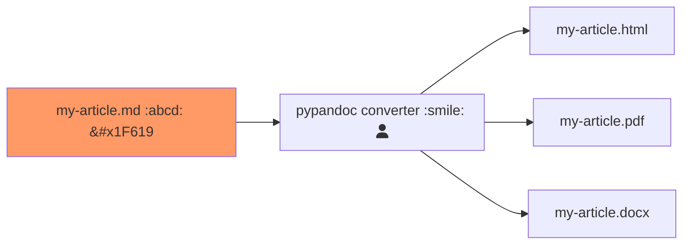

# Blog Posts
Create html blog posts from markdown files using pandoc

This repo contains blog posts posted on [NYC Data Science](https://nycdatascience.com/blog/) as well as personal articles

```mermaid
flowchart LR
    markdown[my-article.md :abcd: &amp#x1F619]:::input
    classDef input fill:#f96;
    
    subgraph pypandoc [pypandoc converter :smile: fa:fa-user]
        
    end
    html[my-article.html]
    pdf[my-article.pdf]
    word[my-article.docx]
    
    markdown-->pypandoc-->html & pdf & word
```
