# Generating articles from Pandoc markdown files

This workflow made possible [^pandoc]Pandoc and [^tufte-css]Tufte CSS. This is a repository of my blog posts and project write-ups[^nycdsa].

[^pandoc]: [Pandoc](https://pandoc.org/MANUAL.html) (and several filters) process the Pandoc markdown files. 

Filters include:

    [pandoc-sidenote](https://github.com/jez/pandoc-sidenote)

    [mermaid-filter](https://github.com/raghur/mermaid-filter)

    [pandoc-plot](https://laurentrdc.github.io/pandoc-plot/MANUAL.html)

    [lua-filters](https://github.com/pandoc/lua-filters)

[^tufte-css]: See Dave Liepmann's [port](https://edwardtufte.github.io/tufte-css/) of Edward R. Tufte's style to CSS

[^nycdsa]: This repo contains blog posts cross-posted on [NYC Data Science](https://nycdatascience.com/blog/) as well as personal articles

### File Conversion Process

```mermaid
flowchart TB
    classDef input fill:lightblue;
    classDef output fill:lightgreen;
    
    start(["Create *.md files\n \nPlace in sibling\n directory to src/"])
    
    markdown[/"🔤 my-article.md"/]:::input
    
    subgraph pypandoc ["🐍 pypandoc converter"]
            
    end
    
    html[/"🙌 my-article.html"/]:::output
    pdf[/"✨ my-article.pdf"/]:::output
    word[/"🤷 my-article.docx"/]:::output
    
    start-->markdown-->pypandoc-->html & pdf & word
```

