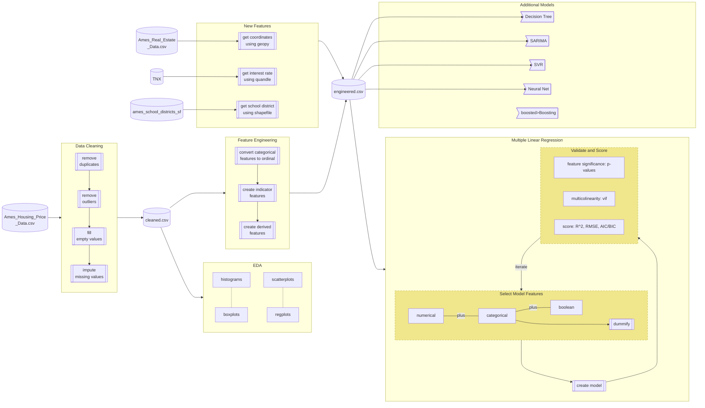

# Predicting Property Sale Values in Ames, Iowa

## Introduction

## The Dataset

## Feature Engineering

## Notable Findings

## Predictive Models

brief overview of models selected

### Model Scoring

| Model            | R2 Train | R2 Test  | RMSE     |
| --------         | -------- | -------- | -------- |
| Elastic-Net      | 0.933    | 0.922    | 0.046    |
| Random Forest    | 0.986    | 0.915    | 0.047    |
| Gradient Boosting| 0.994    | 0.927    | 0.043    |
| SVR              | 0.926    | 0.922    | 0.045    |
| Backprop         | 0.937    | 0.895    | 0.032    |
| SARIMA           | 0.528    | 0.077    |$14,167   |

how did backprop have a worse R2 test but lower RMSE? That's a red flag

### Effect of 1-unit change on mean sale price (and other insights)

| Change                         | Expected Cost | Sale Price Increase |
| ------------------------------ | ------------- | ------------------- |
| +1 sqft living area            | N/A           | +$57                |
| +1 sqft basement area          | N/A           | +$22                |
| +1 sqft finished outdoor space | N/A           | +$11                |
| Installing a fireplace         | $2-5K         | +$4,380             |
| Installing central air         | $3-15K        | +$23,599            |
| Proximity to rail line         | N/A           | -$7,675             |

## Conclusion

## Future Development

## Engineering Process

