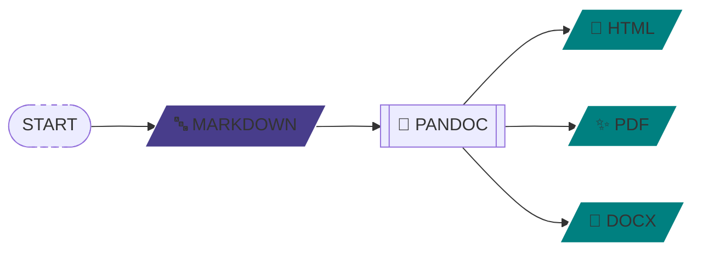

## HATE WYSIWYG?
#### WORDPRESS GOT YOU DOWN 🤷

---

## ️️TRY PANDOC 💪

---
<div class="fragment" data-fragment-index="1"></div>
<div class="fragment" data-fragment-index="2"></div>
<div class="fragment" data-fragment-index="3">Write</div>
<div class="fragment" data-fragment-index="4">Convert</div>
<div class="fragment" data-fragment-index="5">Publish</div>



```mermaid-animation
START 
START-->MARKDOWN MARKDOWN
MARKDOWN-->PYPANDOC PYPANDOC
PYPANDOC-->HTML HTML
PYPANDOC-->PDF PDF
PYPANDOC-->DOCX DOCX
```

---

# ✌ SUCCESS!